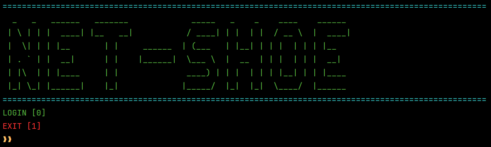
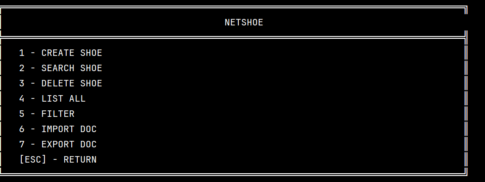

<h1>Projeto de CRUD com terminal personalizado em Spring</h1>
<h2>A ideia do projeto é simular terminais integrados que existem em lojas de shopping, como por exemplo as Americanas,NetShoe,Centauro, etc ....</h2> 

## Menu inicial do programa 

## Meu principal do programa

• Nele você pode fazer todas as operações básicas de um CRUD

• Criar um registro novo de tênis

• Inserir um novo registro

• Listar todos os tênis

• Deletar algum especificado por ID

• Filtrar por marca, cor

• Gerar um arquivo doc, com os dados gerados pelo programa

• Importar de um arquivo as informações para popular o BANCO DE DADOS

